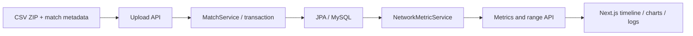

# Communication Analytics Dashboard

경기·발화/Dialogue Act 결과 CSV를 시간축과 네트워크 지표로 탐색하는 코칭 대시보드.

> 문서 검토본. 입력 데이터 공개 권한과 지표 정의를 확인한 뒤 게시합니다.

## Why

따로 저장된 경기 이벤트와 발화 기록을 하나의 시간축으로 연결해, 특정 구간의 상호작용을 살펴보기 위한 도구입니다. 실제 코칭 효과는 [NEEDS VERIFICATION]입니다.

## What it does

- ZIP 안의 메타·경기·DA CSV를 적재합니다.
- Spring Boot/JPA로 경기·발화·이벤트·지표를 조회합니다.
- Next.js 화면에서 시간 구간, DA 패턴, 로그, 레이더·네트워크 뷰를 연결합니다.

## My Contribution

대시보드 전체를 직접 개발했습니다. ZIP/CSV 적재·DB 저장, 시간 구간·발화 패턴별 지표 API와 Next.js 분석 화면을 연결했습니다(2026-09-15 본인 확인 및 커밋 대조). 인터뷰 연구 전체와 외부 ASR/DA 모델의 담당 범위는 별도입니다.

## Architecture



## Key Technical Decisions

- [MatchService](src/main/java/com/lolcoaching/backend/service/MatchService.java)는 여러 파일을 경기 단위로 묶어 적재합니다. 입력 규격과 오류 복구 조건은 추가 문서화가 필요합니다.
- [NetworkMetricService](src/main/java/com/lolcoaching/backend/service/NetworkMetricService.java)는 10초 구간 지표와 선택 시간 범위 계산을 구분합니다.
- [분석 화면](frontend/app/matches/%5Bid%5D/page.tsx)은 범위 요청에 300ms debounce를 적용합니다. 측정된 성능 향상률을 뜻하지 않습니다.

선택 이유와 대안 검토 중 코드에 없는 부분은 [NEEDS VERIFICATION]입니다.

## Results

실제 프로게이머와 코치가 인터뷰 과정에서 사용했습니다(2026-09-15 본인 확인). ZIP/CSV 입력부터 DB·API·연동 UI까지 직접 구현했습니다. 참여 인원·피드백 원문·정량 코칭 효과는 미확인이고, 이번 감사에서 전체 실행·지표 정확성 검증은 수행하지 않았습니다.

## Getting Started

Java 17, Node.js, MySQL 설정이 필요합니다. 공개 tree에는 완성된 환경 설정 예제가 없어 아래 실행 명령만으로 재현 완료를 보장하지 않습니다.

backend에 외부 환경변수로 `SPRING_DATASOURCE_URL`, `SPRING_DATASOURCE_USERNAME`, `SPRING_DATASOURCE_PASSWORD`를 설정하고 스키마 정책을 확인합니다. 과거 설정 파일을 복원해 사용하지 않습니다.

```powershell
# repository root
.\gradlew.bat bootRun
```

frontend의 `.env.local`에 실제 로컬 backend 주소를 `NEXT_PUBLIC_API_URL`로 지정합니다. backend 기본 포트를 사용할 때의 예는 `http://localhost:8080`입니다.

```powershell
cd frontend
npm ci
npm run dev
```

데모 입력은 승인된 합성 자료로 준비합니다. 데이터 스키마·필수 파일·샘플 ZIP은 [NEEDS VERIFICATION]입니다.

## Testing / Evaluation

기존 Spring context 테스트가 존재합니다. 이번 감사에서 실행하지 않았으며 지표 정확성 테스트를 대신하지 않습니다.

우선 검증할 fixture: 발화 없는 경기, 같은 화자의 연속 발화, 방향이 반대인 edge, 10초 경계의 인접 발화, 짧은 선택 구간.

## Limitations

- 현재 방향성 edge의 unique 수를 분모 10으로 나누며 range API만 1.0 상한 적용. 지표 정의를 확정하기 전 표준 밀도로 단정하지 않습니다.
- 범위 분석은 경기 전체 로그를 조회한 뒤 필터링합니다. 대규모 데이터 성능은 미검증입니다.
- 배포 URL·현재 가용성, 데이터 공개 허용 범위, 실제 사용 결과는 미확인입니다.
- `node_modules`가 tracked tree에 포함되어 있습니다. 원본은 그대로 보존했으며 정리는 별도 작업입니다.

## Links

- [Source](https://github.com/hardlyPw/lol-coach-dashboard)
- Portfolio / Demo / Paper: [NEEDS VERIFICATION]
