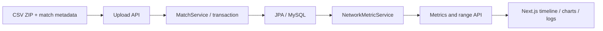

# Communication Analytics Dashboard

경기·발화/Dialogue Act 결과 CSV를 시간축과 네트워크 지표로 탐색하는 코칭 대시보드.

**대시보드 전체 개발 · 실제 프로게이머와 코치의 인터뷰에서 활용**

[**합성 데이터 데모 열기 ↗**](http://3.34.82.181/) · 가상의 경기·발화만 사용하는 읽기 전용 데모

개발 커밋: 2026년 2월. 재현용 자료는 [새로 작성한 합성 예제](examples/synthetic-match.zip)를 제공합니다.

## Why

따로 저장된 경기 이벤트와 발화 기록을 하나의 시간축으로 연결해, 특정 구간의 상호작용을 살펴보기 위한 도구입니다. 경기력 개선을 측정하는 도구로 검증한 것은 아니며, 인터뷰에서 데이터를 탐색하는 데 사용했습니다.

## What it does

- ZIP 안의 메타·경기·DA CSV를 적재합니다.
- Spring Boot/JPA로 경기·발화·이벤트·지표를 조회합니다.
- Next.js 화면에서 시간 구간, DA 패턴, 로그, 레이더·네트워크 뷰를 연결합니다.

## My Contribution

대시보드 전체를 직접 개발했습니다. ZIP/CSV 적재·DB 저장, 시간 구간·발화 패턴별 지표 API와 Next.js 분석 화면을 연결했습니다. 인터뷰 연구 전체와 외부 ASR/DA 모델의 담당 범위는 별도입니다.

## Architecture



## Key Technical Decisions

- [MatchService](src/main/java/com/lolcoaching/backend/service/MatchService.java)는 여러 파일을 경기 단위로 묶어 적재합니다. [입력 파일·열 순서·행 오류 처리](docs/INPUT-FORMAT.md)를 문서화했습니다.
- [NetworkMetricService](src/main/java/com/lolcoaching/backend/service/NetworkMetricService.java)는 10초 구간 지표와 선택 시간 범위 계산을 구분합니다.
- [분석 화면](frontend/app/matches/%5Bid%5D/page.tsx)은 범위 요청에 300ms debounce를 적용합니다. 측정된 성능 향상률을 뜻하지 않습니다.

위 설명은 구현의 동작과 기술적 제약을 정리한 것입니다.

## Results

실제 프로게이머와 코치가 인터뷰 과정에서 사용했습니다. ZIP/CSV 입력부터 DB·API·연동 UI까지 직접 구현해 경기와 발화를 함께 탐색하는 화면을 제공했습니다. 공개 데모용 합성 데이터와 읽기 전용 모드를 추가하고 로컬 빌드·API 통합 테스트를 수행했습니다. 지표의 통계적 정확성과 정량 코칭 효과를 검증한 것은 아닙니다.

## Getting Started

Java 17, Node.js, MySQL 호환 DB 설정이 필요합니다. [합성 데이터 데모 실행 가이드](docs/PUBLIC-DEMO.md)에 환경변수·초기 적재·읽기 전용 설정과 AWS에서 확인한 환경을 정리했습니다.

backend에 외부 환경변수로 `SPRING_DATASOURCE_URL`, `SPRING_DATASOURCE_USERNAME`, `SPRING_DATASOURCE_PASSWORD`를 설정하고 스키마 정책을 확인합니다. 과거 설정 파일을 복원해 사용하지 않습니다.

```powershell
# repository root
.\gradlew.bat bootRun
```

frontend의 `.env.local`에 실제 로컬 backend 주소를 `NEXT_PUBLIC_API_URL`로 지정합니다. backend 기본 포트를 사용할 때의 예는 `http://localhost:8080`입니다.

```powershell
cd frontend
npm ci
npm run dev
```

데모 입력은 [합성 ZIP](examples/synthetic-match.zip)을 사용합니다. [입력 형식과 업로드 예시](docs/INPUT-FORMAT.md)에서 필수 파일·열 순서·시간 단위·파싱 한계를 확인할 수 있습니다. 실제 경기·발화 원문을 추가로 공개하지 않습니다.

## Testing / Evaluation

읽기 전용 필터 테스트 8개와 H2 기반 통합 테스트 2개를 통과했습니다. 통합 테스트는 합성 ZIP 적재, 경기 상세, 7개 패턴의 조회, 범위 분석 응답 및 업로드·삭제 거부를 확인합니다. 테스트 실행에는 운영 DB가 필요하지 않습니다.

```sh
./gradlew test --tests '*DemoReadOnlyFilterTests' --tests '*DemoIntegrationTests'
```

프런트엔드 빌드와 `npx tsc --noEmit`도 확인했습니다. AWS Ubuntu·Java 17·MariaDB 환경에서 합성 데이터 적재, 7개 패턴 조회, 변경 요청 차단과 화면의 시간 구간·패턴 변경을 검증했습니다. 계산 지표의 통계적 정확성 검증은 별도입니다.

우선 검증할 fixture: 발화 없는 경기, 같은 화자의 연속 발화, 방향이 반대인 edge, 10초 경계의 인접 발화, 짧은 선택 구간.

## Limitations

- 현재 방향성 edge의 unique 수를 분모 10으로 나누며 range API만 1.0 상한 적용. 지표 정의를 확정하기 전 표준 밀도로 단정하지 않습니다.
- 범위 분석은 경기 전체 로그를 조회한 뒤 필터링합니다. 대규모 데이터 성능은 미검증입니다.
- 현재 공개 데모는 새로 만든 합성 데이터만 포함합니다. 인터뷰 활용 사실과 합성 데모를 구분하며 실제 원자료의 공개 허용 범위는 별도 확인 대상입니다. 상시 가용성 SLA는 제공하지 않습니다.
- `node_modules`가 tracked tree에 포함되어 있습니다. 원본은 그대로 보존했으며 정리는 별도 작업입니다.

## Links

- [Source](https://github.com/hardlyPw/lol-coach-dashboard)
- [입력 명세·합성 예제](docs/INPUT-FORMAT.md)
